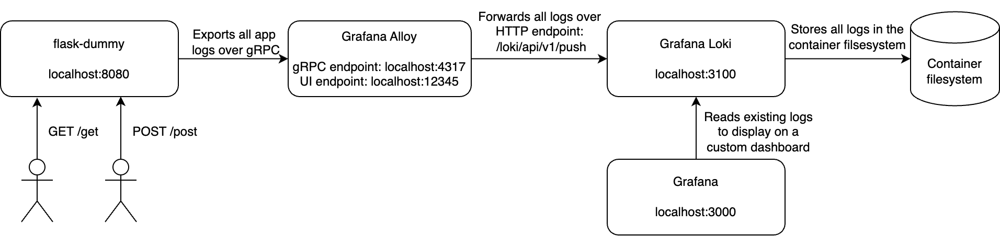

# Test task

## System requirements to deploy the workload

Linux, Mac, Windows machine:

- [Docker Desktop](https://docs.docker.com/get-docker/)

Linux server:

- [Docker Engine](https://docs.docker.com/engine/)
- [Docker Compose](https://docs.docker.com/compose)

## Deployment

```
docker compose up -d
```

## Testing the solution

1. Go to http://localhost:3000/dashboards and open up the `Loki logs` dashboard, you should see a couple of logs about the `flask-dummy` app startup
2. (Optional) Go to http://localhost:12345/graph to see Grafana Alloy graph.
3. Send a GET request to `flask-dummy`

   ```
   curl localhost:8080/get
   ```

   You should see a `WARN` level log with body `Received GET request` appear in the Grafana dashboard. (Dashboard refreshes automatically every 5 seconds).

4. Send a POST request to `flask-dummy`
   ```
   curl -X POST localhost:8080/post
   ```
   You should see an `INFO` level log with body `Received POST request` appear in the Grafana dashboard. (Dashboard refreshes automatically every 5 seconds).

## Service diagram


